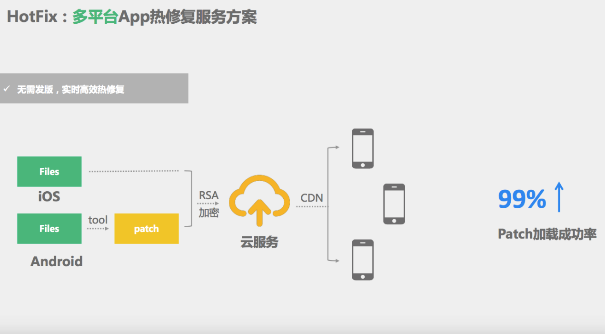

# 简介
全平台App热修复服务方案，让您无需等待实时修复应用线上问题。

## 部署示意图

## 组件
* [hotfix-api](https://github.com/hotfix-project/hotfix-api) 
* [hotfix-manager](https://github.com/hotfix-project/hotfix-manager)
* [hotfix-Android](https://github.com/hotfix-project/hotfix-Android)
* [hotfix-iOS](https://github.com/hotfix-project/hotfix-iOS)
* [hotfix-doc](https://github.com/hotfix-project/hotfix-doc)

## 应用场景
HotFix提供的热修复能力，让您对应用程序的控制更加自由。
您可以使用HotFix：

* 紧急修复线上问题。
* 快速发布新鲜功能。
